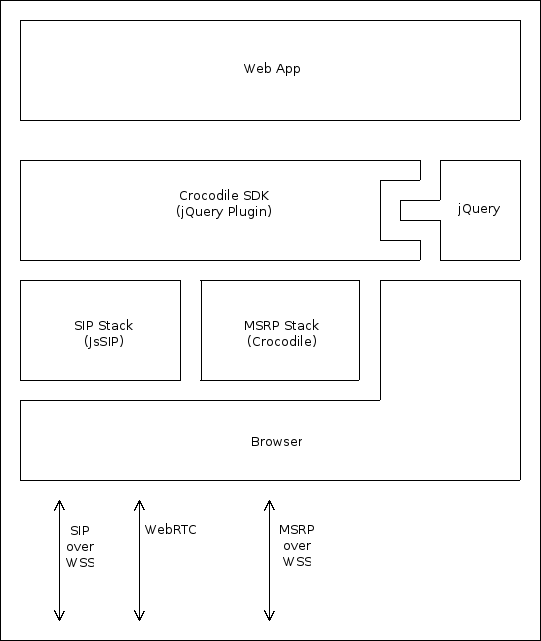

# Crocodile RTC Javascript Library Reference Manual #

## Introduction ##

The Crocodile Real-Time Communication Platform is an open, standards-based, cloud-based, global real-time communications network and SDK which enables service providers, web-app, and mobile-app developers to easily and cost-effectively add hosted real-time communications to services and applications.

The Crocodile RTC SDK consists of two separate parts:

*   _Crocodile_ _RTC_ _Integration_ _API_ - to enable third-party websites to integrate with the Crocodile Real-Time Communication Platform for subscriber and billing management.

*   _Crocodile_ _RTC_ _Javascript_ _Library_ - to enable third-parties to easily and quickly add real-time communications to their applications.

This documentation describes version 1.0 of the Crocodile RTC Javascript Library.

## Signalling ##

The Crocodile RTC Network is a highly available and secure SIP and MSRP network compliant with the latest IETF RFCs. SIP and MSRP networks are complex and time-consuming to build and maintain but Crocodile RCS Ltd believes that application developers should not have to understand real-time communications in general (and SIP and MSRP specifically) to be able to make full use of real-time communications.

The Crocodile RTC Javascript Library provides a simple interface to add real-time communication capabilities to an application without having to understand the underlying protocols. As you read this manual you will find very few references to the actual signalling protocols used [1] as the Crocodile RTC Javascript Library API has been designed around the following principles:

1.   Application developers should not have to understand real-time communication protocols to use them.

2.   The simple scenarios should be trivial to implement (if a developer doesn't want something specific to happen the library should do the right thing by default).

3.   The advanced scenarios for communications should be easy to implement (default behaviours can be overridden on a case-by-case basis).

### The Crocodile Real-Time Communication Platform advantage ###

Using the Crocodile Real-Time Communication Platform is the easiest and quickest way to add real-time communication capability to your application. The Crocodile RTC Javascript Library is far simpler to use than any proprietary mechanism or standard signalling stack.

In addition to reducing development time and complexity using the Crocodile Real-Time Communication Platform for your application provides the following advantages.

1.   _Interoperability_ - many successful services are islands, but you never know how your service might grow. Using the Crocodile Real-Time Communication Platform means you have interoperability built-in from the start.

2.   _Scalability_ _and_ _resilience_ - true horizontal scaling and five 9s reliability is hard to acheive, but with the Crocodile Real-Time Communication Platform you can take full advantage of Crocodile RCS Ltd's expertise and more than 10 years of IETF work on reliable IP communications.

3.   _Manageability_ - the Crocodile RTC Integration API makes it easy to integrate subscriber management (including billing) with your own Customer Relationship Management platforms.

## The Crocodile RTC Javascript Library ##

#### Figure 1.1 Crocodile RTC Javascript Library architecture ####

### Other libraries used by the Crocodile RTC Javascript Library ###

#### Table 1.1 Libraries used by the Crocodile RTC Javascript Library ####

[Crocodile MSRP](https://code.google.com/p/crocodile-msrp/)

[JQuery](http://jquery.com/)

[JsSIP](http://www.jssip.net/)

### Using the Crocodile RTC Javascript Library ###

The Crocodile RTC Javascript Library may be used with any compliant SIP network, but out of the box it is designed to connect to (and work seamlessly) with the Crocodile RTC Network. To use the Crocodile RTC Network you must create a developer account in our developer portal and allocate yourself an API key.
 
To use the Crocodile RTC Javascript Library in your application you just need to include it, and jQuery, at the top of your page.

#### Example 1.1 Including the Crocodile RTC Javascript Library in your page ####

	
	

#### Note ####

You can choose whether to include the Crocodile RTC Javascript Library directly from the developer portal website or from the server that is hosting your application.

The advantage of including the Crocodile RTC Javascript Library from the server hosting your application is that GET requests used to establish WebSocket connections will contain an Origin: header identifying the server hosting the application. This allows you to enable API key security for your application in the developer portal which ensures that your API key is only used with a specific web-site.

Once you have included the Crocodile RTC Javascript Library you need to instantiate the Crocodile RTC Javascript Library object.

#### Example 1.2 Instantiating the Crocodile RTC Javascript Library object ####

	

[1] some signalling-specific values are exposed for a few very advanced use-cases